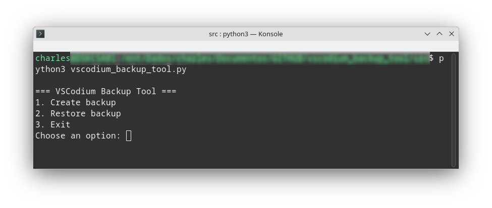

<h1 align="center">🧩 Codium Backup Tool</h1>

  Ferramenta de backup e restauração para VSCodium com suporte a tradução

  

Codium Backup Tool é um utilitário leve e interativo para salvar e restaurar configurações do VSCodium, com suporte a empacotamento `.deb` e execução via terminal com `codium-bkp`.

Codium Backup Tool is a lightweight interactive utility to backup and restore your VSCodium setup, including `.deb` packaging and terminal launcher `codium-bkp`.

---

    Backup and Restore Tool for VSCodium with Translation Support 

Codium Backup Tool is a lightweight and interactive utility for saving and restoring VSCodium configurations, supporting `.deb` packaging and running via terminal with `codium-bkp`. Codium Backup Tool is a lightweight interactive utility to backup and restore your VSCodium setup, including `.deb` packaging and terminal launcher `codium-bkp`.

